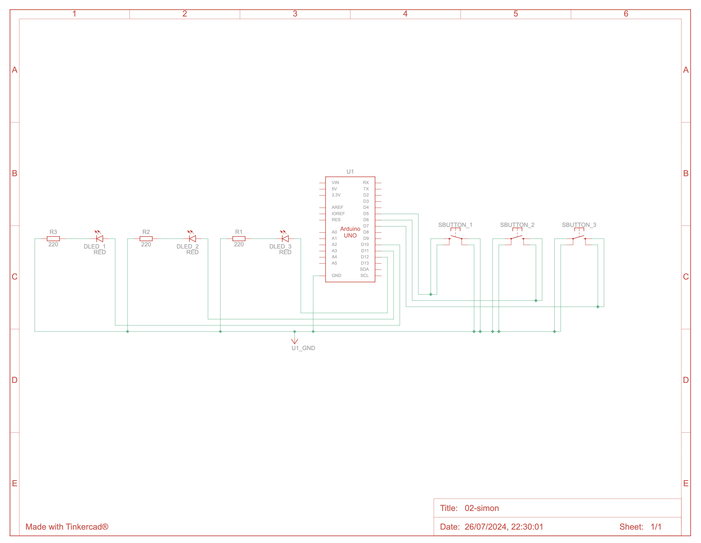
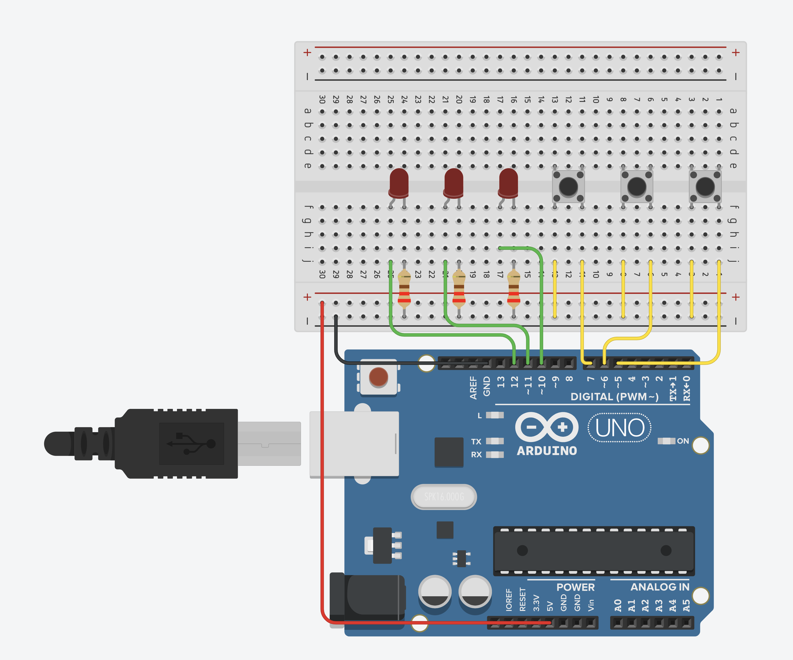

# 02-simon
A simple implementation of Simon says.

## Components
- Arduino Uno R3
- 3x LED red
- 3x 220 ohm resistor
- 3x push button

## Schematic

Note that the pins the buttons are connected to are using the pin's internal pull-up resistor, which is why they are wired in "reverse", without a pull-down resistor.

## Design & implementation
The game consists of 3 "screens".

- Main menu: the 3 LEDs light up in sequence until the player presses any button. See `mainMenu()` in [src/main.cpp](src/main.cpp).
- Game screen: the game generates a sequence in which the LEDs get lit up. It starts by playing the first item of the sequence, followed by flashing all 3 LEDs, signaling the user they need to repeat it by pressing the buttons in the same sequence. If the user didn't repeat the sequence properly, the game over screen is displayed, with a fail animation. If the user repeated the sequence correctly, the sequence is played back again, including the next item in the full sequence. If the user repeats the full sequence successfully, the game over screen is displayed, with a success animation. See `gameLoop()` in [src/main.cpp](src/main.cpp).
- Game over screen: plays back an animation depending on whether the user succeeded or not, then goes back to the main menu.

Other notable stuff:
- The `Button` class implements a [debounced button](https://docs.arduino.cc/built-in-examples/digital/Debounce/) that uses the input pin's internal pull-up resistor, instead of a pull-down resistor on the breadboard. This removes 3 resistors from the circuit. Yay.
- The `AnimationFrame` and `Animation` classes allow defining animations of the 3 LEDs. Each frame consists of the state of each LED and a duration. An animation instance then plays back those frames accordingly. The animation "system" also makes it easy to clear or set all LEDs at once. Ideally, it would be more flexible in terms of number of LEDs and pins used to control the LEDs.
- Pretty much everything is using `millis()` instead of `delay()`, like in a "normal" computer game. This way we can listen for input while simultaniously playing back LED animations, as examplified in the main menu.
